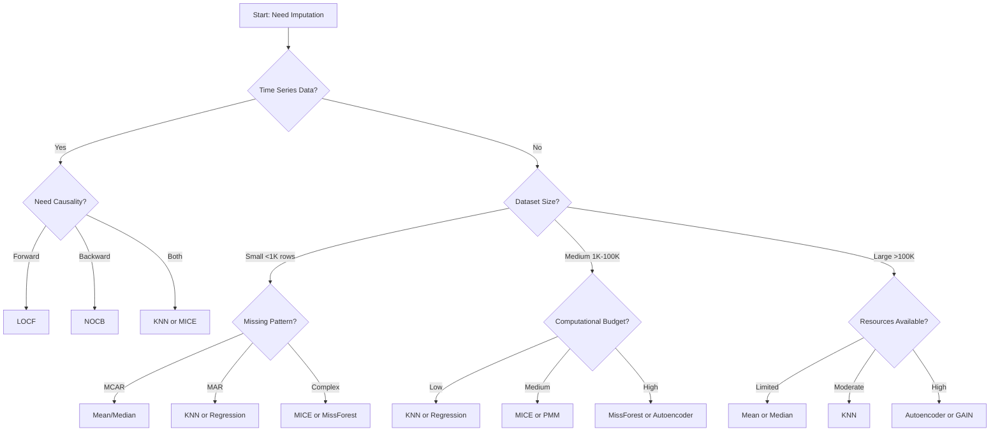

# Method Selection Guide

Choosing the right imputation method depends on your data characteristics, computational resources, and use case. This guide helps you make an informed decision.

## Decision Tree



## By Use Case

### 1. Quick Baseline / Prototyping

**Recommended:** Mean or Median Imputation

```python
from imputation_showcase import MeanImputer, MedianImputer

# For normally distributed data
imputer = MeanImputer()

# For skewed data or with outliers
imputer = MedianImputer()

df_imputed = imputer.impute(df)
```

**When to use:**
- Initial data exploration
- Establishing performance baseline
- Computational resources are limited
- Missingness is <10%

**Limitations:**
- Poor accuracy for MAR/MNAR data
- Reduces variance
- Ignores feature relationships

### 2. Time Series / Sensor Data

**Recommended:** LOCF, NOCB, or KNN

```python
from imputation_showcase import LOCFImputer, NOCBImputer, KNNImputerMethod

# For slowly changing variables
imputer = LOCFImputer()

# For backward filling
imputer = NOCBImputer()

# For better accuracy with multiple sensors
imputer = KNNImputerMethod(k=5)

df_imputed = imputer.impute(df)
```

**Selection criteria:**
- **LOCF:** Slowly changing values, forward causality
- **NOCB:** Rare, mainly for specialized applications
- **KNN (k=3-7):** Multiple correlated sensors, higher accuracy needed

**Example:**
```python
# Temperature sensor with 15-minute intervals
if time_interval <= '15min' and change_rate == 'slow':
    imputer = LOCFImputer()
elif num_sensors > 3:
    imputer = KNNImputerMethod(k=5)
```

### 3. Machine Learning Pipelines

**Recommended:** KNN, MICE, or MissForest

```python
from imputation_showcase import KNNImputerMethod, MICEImputer, MissForestImputer

# General purpose - good balance
imputer = KNNImputerMethod(k=5)

# For complex relationships
imputer = MICEImputer(random_state=42)

# For non-linear patterns (slower)
imputer = MissForestImputer(random_state=42)
```

**Selection criteria:**

| Method | When to Use | Pros | Cons |
|--------|-------------|------|------|
| KNN | Linear/moderate relationships | Fast, reliable | Sensitive to scaling |
| MICE | Multiple missing variables | Principled, flexible | Slower, may not converge |
| MissForest | Non-linear relationships | Very accurate | Very slow |

**Pipeline example:**
```python
from sklearn.pipeline import Pipeline
from sklearn.preprocessing import StandardScaler
from sklearn.ensemble import RandomForestClassifier

# Custom imputation step
class ImputationStep:
    def __init__(self, imputer):
        self.imputer = imputer

    def fit(self, X, y=None):
        return self

    def transform(self, X):
        return self.imputer.impute(X)

pipeline = Pipeline([
    ('impute', ImputationStep(KNNImputerMethod(k=5))),
    ('scale', StandardScaler()),
    ('classify', RandomForestClassifier())
])

pipeline.fit(X_train, y_train)
```

### 4. Statistical Analysis / Research

**Recommended:** MICE or PMM

```python
from imputation_showcase import MICEImputer, PMMImputer

# Standard approach in statistics
imputer = MICEImputer(random_state=42)

# More robust to model misspecification
imputer = PMMImputer(k=5, random_state=42)

df_imputed = imputer.impute(df)
```

**Why these methods:**
- Widely accepted in statistics literature
- Preserve distributions
- Account for uncertainty (in full MICE implementation)
- PMM guarantees realistic values

**Important:** For proper statistical inference, use multiple imputation (create multiple imputed datasets). This library provides single imputation; for multiple imputation, consider the `mice` or `miceforest` packages.

### 5. High-Dimensional Data

**Recommended:** Bayesian PCA, SoftImpute, or Autoencoder

```python
from imputation_showcase import BayesianPCAImputer, SoftImputeImputer, AutoencoderImputer

# For low-rank structure (e.g., recommendations)
imputer = SoftImputeImputer(max_iters=100)

# Probabilistic approach
imputer = BayesianPCAImputer(n_components=10)

# For very large datasets with non-linearity
imputer = AutoencoderImputer(
    hidden_layer_sizes=(50, 20, 50),
    max_iter=200,
    random_state=42
)

df_imputed = imputer.impute(df)
```

**Choosing components:**
```python
from sklearn.decomposition import PCA

# Determine good n_components
pca = PCA()
pca.fit(df_filled)  # Fill with mean first

# Find number of components explaining 90% variance
cumsum = np.cumsum(pca.explained_variance_ratio_)
n_components = np.argmax(cumsum >= 0.90) + 1

imputer = BayesianPCAImputer(n_components=n_components)
```

### 6. Production Systems

**Recommended:** KNN or Mean/Median

```python
from imputation_showcase import KNNImputerMethod, MeanImputer

# For real-time systems
imputer = MeanImputer()  # Fastest

# For batch processing with higher accuracy
imputer = KNNImputerMethod(k=5)

# Save imputer parameters for consistency
import joblib
joblib.dump(imputer, 'imputer_model.pkl')
```

**Production considerations:**
- **Latency:** Mean/Median < KNN < MICE < MissForest
- **Memory:** Most methods have low memory footprint
- **Consistency:** Use same imputer fitted on training data
- **Monitoring:** Track missingness patterns over time

**Production checklist:**
```python
import time
import logging

class ProductionImputer:
    def __init__(self, imputer, timeout=10.0):
        self.imputer = imputer
        self.timeout = timeout
        self.logger = logging.getLogger(__name__)

    def impute(self, df):
        start = time.time()

        try:
            # Validate input
            assert not df.empty, "Empty dataframe"
            missing_pct = df.isna().sum().sum() / df.size
            self.logger.info(f"Missing: {missing_pct:.2%}")

            # Impute with timeout protection
            result = self.imputer.impute(df)

            elapsed = time.time() - start
            if elapsed > self.timeout:
                self.logger.warning(f"Imputation took {elapsed:.2f}s")

            return result

        except Exception as e:
            self.logger.error(f"Imputation failed: {e}")
            # Fallback to mean imputation
            return MeanImputer().impute(df)
```

## By Data Characteristics

### Missing Data Pattern

#### MCAR (Missing Completely at Random)

Any method works, but simple ones are often sufficient:

```python
from imputation_showcase import MeanImputer, MedianImputer

# Choose based on distribution
if data_is_normal:
    imputer = MeanImputer()
else:
    imputer = MedianImputer()
```

#### MAR (Missing at Random)

Use methods that leverage relationships:

```python
from imputation_showcase import KNNImputerMethod, MICEImputer, RegressionImputer

# For moderate datasets
imputer = KNNImputerMethod(k=5)

# For multiple variables with missingness
imputer = MICEImputer()

# For specific feature relationships
imputer = RegressionImputer()
```

#### MNAR (Missing Not at Random)

Most difficult; consider domain-specific approaches or models that account for missingness:

```python
# Add missingness indicator
df['was_missing'] = df['feature'].isna().astype(int)

# Then impute
from imputation_showcase import KNNImputerMethod
imputer = KNNImputerMethod(k=5)
df[['feature']] = imputer.impute(df[['feature']])
```

### Data Size

**Small (<1,000 rows):**
```python
# Can use any method, prefer simpler ones
from imputation_showcase import MeanImputer, KNNImputerMethod, MICEImputer

imputer = MICEImputer()  # Even complex methods are fast
```

**Medium (1,000-100,000 rows):**
```python
# Balance accuracy and speed
from imputation_showcase import KNNImputerMethod, PMM Imputer

imputer = KNNImputerMethod(k=5)  # Good default
```

**Large (>100,000 rows):**
```python
# Prioritize speed
from imputation_showcase import MeanImputer, MedianImputer

imputer = MeanImputer()  # O(n) complexity

# Or use sampling for complex methods
sample_size = 10000
df_sample = df.sample(n=sample_size)
imputer = KNNImputerMethod(k=5)
imputer_fitted = imputer.impute(df_sample)  # Fit on sample
# Apply learned patterns to full data
```

### Missingness Percentage

**Low (<10%):**
- Any method works
- Simple methods often sufficient

**Moderate (10-30%):**
- Use model-based methods (KNN, MICE, regression)
- Evaluate carefully

**High (30-50%):**
- Use sophisticated methods (MICE, MissForest)
- Consider if imputation is appropriate
- Validate extensively

**Very High (>50%):**
- ⚠️  **Warning:** Imputation may not be reliable
- Consider dropping variables
- Use domain knowledge
- Model missingness explicitly

## Experimental Comparison

When unsure, compare multiple methods:

```python
from imputation_showcase import (
    MeanImputer, KNNImputerMethod, MICEImputer,
    MissForestImputer, rmse
)
from sklearn.model_selection import cross_val_score
from sklearn.ensemble import RandomForestRegressor

# Introduce artificial missingness for validation
df_complete = df.copy()
mask = create_missing_mask(df, missing_rate=0.2)
df_missing = df_complete.copy()
df_missing[mask] = np.nan

methods = {
    'Mean': MeanImputer(),
    'KNN-3': KNNImputerMethod(k=3),
    'KNN-5': KNNImputerMethod(k=5),
    'MICE': MICEImputer(random_state=42),
    'MissForest': MissForestImputer(random_state=42)
}

results = []
for name, imputer in methods.items():
    # Impute
    df_imputed = imputer.impute(df_missing)

    # Evaluate imputation quality
    imputation_rmse = rmse(
        df_complete.values[mask],
        df_imputed.values[mask]
    )

    # Evaluate downstream task (if applicable)
    model = RandomForestRegressor(random_state=42)
    cv_score = cross_val_score(
        model, df_imputed, y, cv=5, scoring='r2'
    ).mean()

    results.append({
        'method': name,
        'imputation_rmse': imputation_rmse,
        'downstream_r2': cv_score
    })

results_df = pd.DataFrame(results)
print(results_df.sort_values('downstream_r2', ascending=False))
```

## Quick Reference by Scenario

| Scenario | Top Choice | Alternative | Avoid |
|----------|-----------|-------------|-------|
| **Prototype/Quick** | Mean/Median | KNN | MissForest, GAIN |
| **Time Series** | LOCF | KNN | Mean/Median |
| **ML Pipeline** | KNN | MICE, MissForest | Hot Deck |
| **Small Data** | MICE | PMM, MissForest | Mean/Median |
| **Large Data** | Mean/Median | KNN (sampled) | MissForest, GP |
| **High Dimensional** | Bayesian PCA | SoftImpute | KNN |
| **Production** | Mean/KNN | - | MissForest, GAIN |
| **Non-linear** | MissForest | Autoencoder | Regression |
| **Preserve Distribution** | PMM | Hot Deck | Mean |

## Hyperparameter Tuning

For methods with hyperparameters:

### KNN - Choosing k

```python
from sklearn.model_selection import GridSearchCV
from sklearn.linear_model import Ridge

k_values = [3, 5, 7, 10, 15]
best_score = -np.inf
best_k = 5

for k in k_values:
    imputer = KNNImputerMethod(k=k)
    X_imputed = imputer.impute(X_train)
    model = Ridge()
    score = cross_val_score(model, X_imputed, y_train, cv=5).mean()

    if score > best_score:
        best_score = score
        best_k = k

print(f"Best k: {best_k} with score: {best_score:.4f}")
```

### Bayesian PCA - Choosing Components

```python
# Try different numbers of components
for n_comp in [2, 5, 10, 15]:
    imputer = BayesianPCAImputer(n_components=n_comp)
    df_imputed = imputer.impute(df_train)
    # Evaluate reconstruction quality
    score = evaluate_reconstruction(df_train, df_imputed)
    print(f"n_components={n_comp}: {score:.4f}")
```

## Next Steps

- Review [Evaluation Metrics](evaluation.md) to assess imputation quality
- Check [Best Practices](best-practices.md) for production deployment
- See [Examples](../examples/time-series.md) for complete workflows
- Consult [API Reference](../api/methods.md) for technical details
